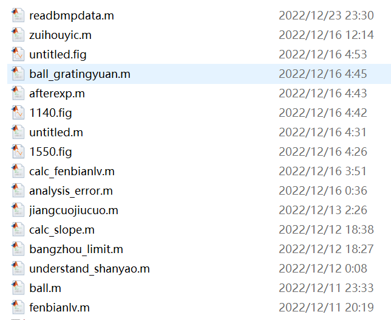
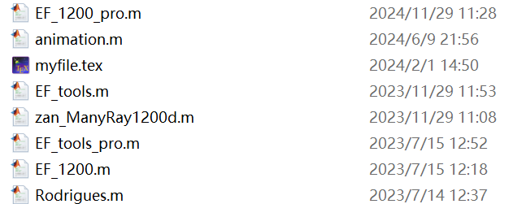
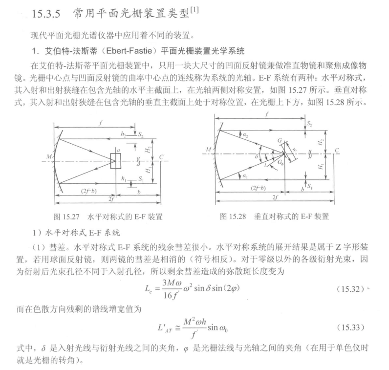

# SpectroRayTrace
a ray-tracing platform for the Czerny-Turner spectrometer using Matlab.

## Origin

This repository is my work in my previous *Advanced Project* lab course in Shenzhen Technology University, supervised by Prof. Leifeng Cao

In the third semester, I developed the 2D version.

In the fourth semester, I developed the basic 3D version in just few weeks.

Back then, one task of a competition ([全国大学生光电设计竞赛](http://gd.p.moocollege.com/datacenter/news/detail?id=4342&path=%2Fdatacenter%2Fnews%2Fdynamicevents) ) is to measure the concentration of the alcohol in a contactless or non-destructive way.

My friend Zhu majored in B.E. EE invited me to join with him. 

Given my previous work, I decided to build an NIR spectrometer to complete it.

Team members: 

- Lin Yuanfeng (control)

- Zhu Leixin (readout circuit and data analysis)

- Zhao Annan (me)

We failed in the competition, due to my fault in the structure design plus the system needs appropriate calibration to reach high precision. We should have develop a automatic calibration system.

## Where to begin

The repository is very messy, sorry for that.

It has been a while since I developed the 2D ray tracing platform, so I have forgot which are the main programs, but the time log may help you to determine.

As for 3D version, it is clearer:

- The `EF_1200_pro.m` is a static version
  - 1200 means the grating used in it is 1200 linepairs / mm
  - EF means using the Ebert-Fastie structrue
    - 《现代应用光学》by 张以谟
    - The difference between EF and CT is the number of sphere mirror (1 for EF 2 for CT).

- The `animation.m` is used to make movies.
- `myfile.tex` is used to generate PDF version, I want to put it in my latex report.
- `EF-tools.m` analyze the accessible wavelength range of this EF system